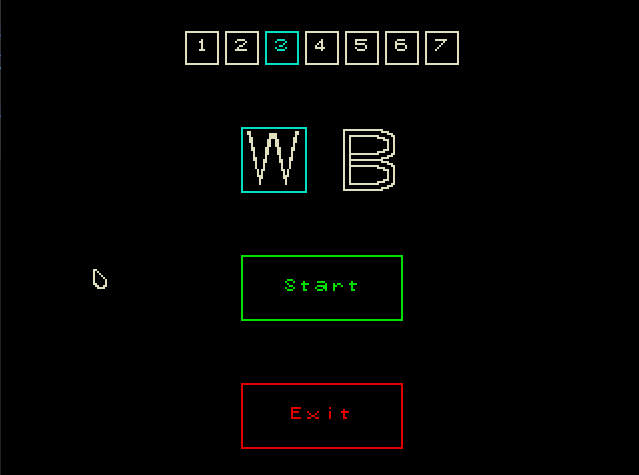
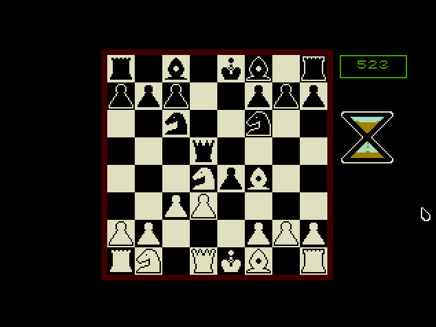

# BMC-OS



This project is a custom OS that followed the structure from [Blog OS](https://github.com/phil-opp/blog_os). It is an OS to play the game of chess against my own custom engine.

It was made in ~50 days during a 100 day coding challenge. Where the goal was to consistently code at least 1h every day. The name `BMC-OS` is an acronym for Bare Metal CARL where CARL is the name of my chess engine.

## Features:
- Full chess game playable
- 2200-ish computer rated engine to play against (rating may change due to the change in environment)
- Engine eval when playing against it
- Engine difficulty selector



# How to run it
## Prerequisites
- Rust (Currently using v1.65 but I haven't tested if earlier versions work)
- A remote desktop software (Used `vncviewer`)

Currently there is a `./run_os.sh --release` script that builds the project, runs it and launches VNC viewer

Another way is to run `cargo run --release` then open up an alternative to VNC viewer on port 5900

# Known issue
There is a chance when running the OS, the mouse driver fails to initialize and you get the following error message:

```
panicked at 'called `Result::unwrap()` on an `Err` value: "mouse did not respond to the command"'
```

Sometimes running the script without the `--release` flag and running it again with said flag would fix the issue, I will have to look into it, but for now *it's a feature :)*